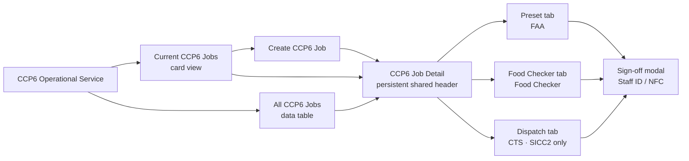
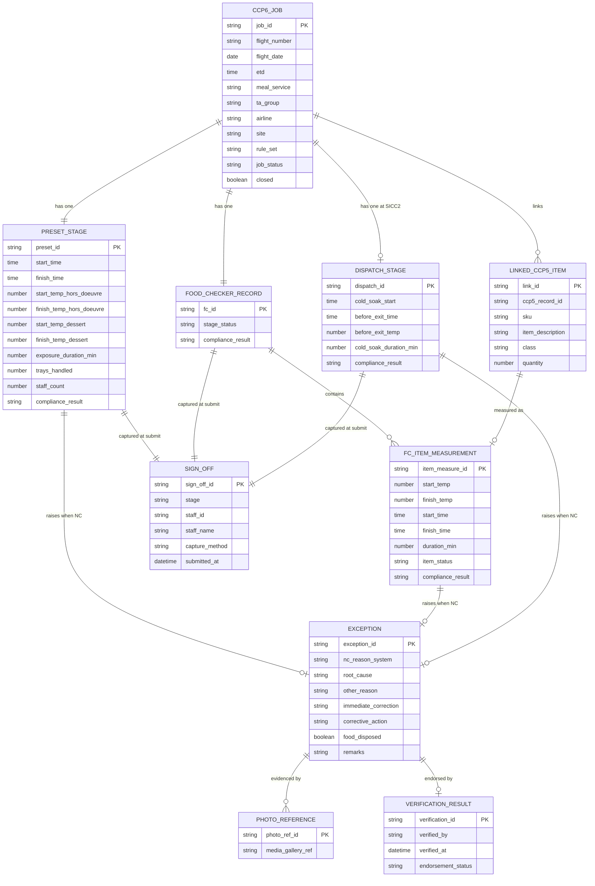
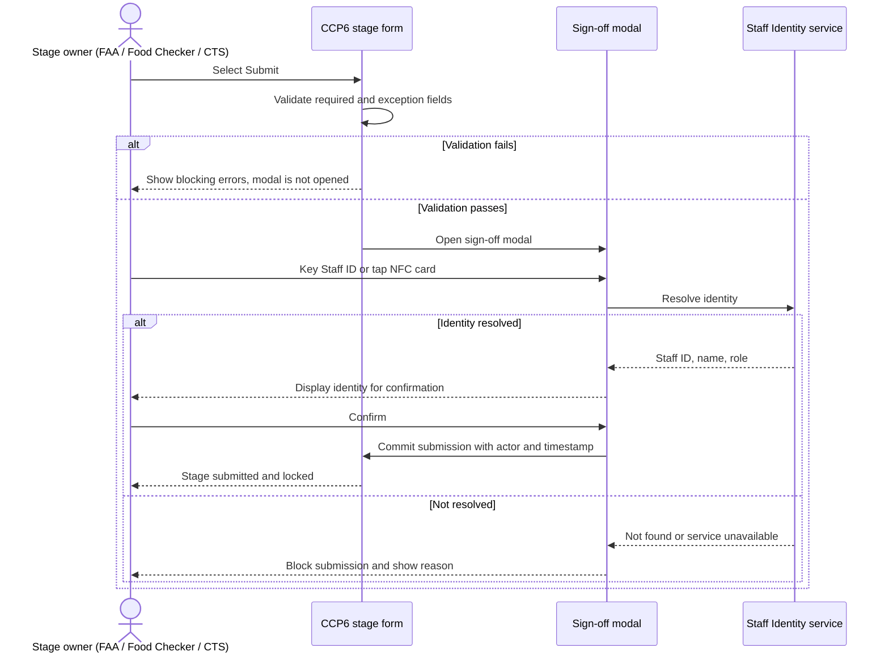
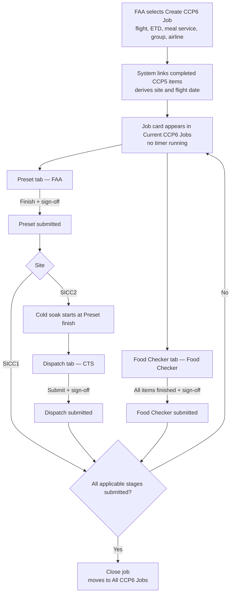
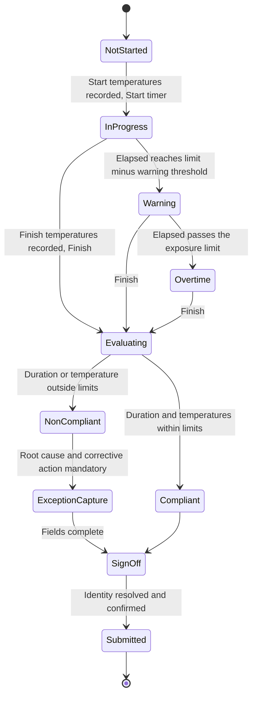
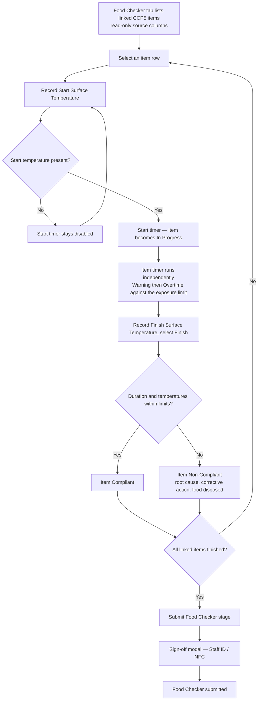
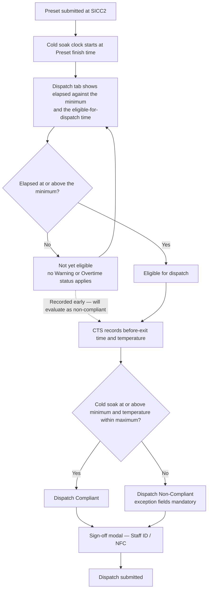
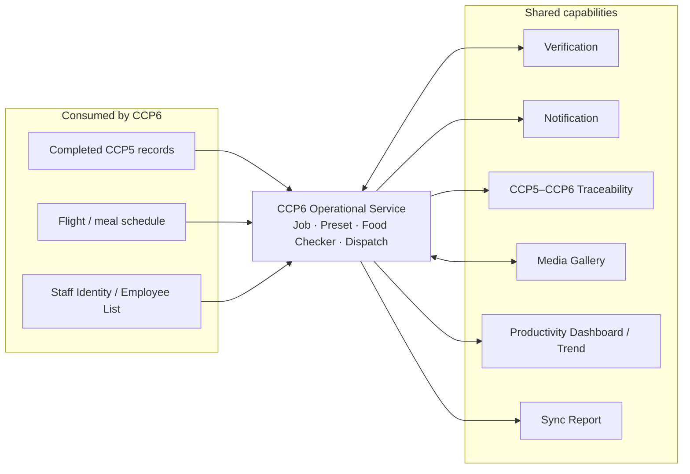

**FUNCTIONAL SPECIFICATION**

# CCP6 Operational Service

Parent CCP6 Job • Preset • Food Checker • Dispatch

| **Document** | **Value** |
|---|---|
| Service | CCP6 Operational Service |
| Platform | FTMS 2.0 / DOM |
| Version | v14 |
| Sites | SICC1 (C1) and SICC2 (C2) |
| Status | Draft for design review |
| Primary source | CCP6 BRD v1.5 |
| Supersedes | v13 |
| Prepared date | 6 August 2026 |

> **Scope boundary.** This document specifies the CCP6 operational service and its own record-level views and reports. Verification, Notification, CCP5–CCP6 Traceability, Sync Report, Productivity Dashboard / Trend Analysis, and Media Gallery are separate capabilities; only their integration points appear here.

> **Changes in v14.** (1) Operational actors are captured through a **sign-off modal at each stage submission**, not through a form field — the `Recorded by` / `Staff ID` field is removed from the Dispatch tab and from all stage forms. (2) Four design decisions confirmed in review are locked into the specification (see §13). (3) All diagrams are now inline Mermaid so they stay in sync with the text.

---

# 1. Overview

CCP6 controls the time and surface temperature of chilled potentially hazardous food (PHF) during tray set-up (**Preset**) and, at SICC2, immediately before dispatch from the chilled holding room (**Dispatch**). A **Food Checker** workflow captures item-level time and temperature observations for the same flight. All workflows link to completed CCP5 records so traceability runs end to end.

The service replaces the C1 and C2 paper forms with a **flight-centred job model**: one parent CCP6 Job holds the shared flight header and the linked CCP5 items once, and the operational stages run as tabs inside it.

## 1.1 Operational workflows

| **Workflow** | **Purpose** | **Owner** |
|---|---|---|
| **Preset** | Exposure time and surface temperature during tray assembly, until food returns to the chilled holding room. | FAA |
| **Food Checker** | Item-level time and temperature observations for the items linked to the flight. | Food Checker |
| **Dispatch** (SICC2 only) | Time and temperature immediately before food leaves the chilled holding room. | CTS Team |

## 1.2 CCP6 critical controls

| **Control** | **Measured period** | **Critical limit** |
|---|---|---|
| **Preset exposure** | Removal from the Refrigeration Unit (RU) for preset until return to RU / chilled holding room | Standard/OAL: ≤45 min and ≤15 °C; UA: ≤30 min and ≤15 °C |
| **Cold soak / Dispatch** | Return to chilled holding until immediately before exiting the holding room | Minimum cold soak 2 hr (Qantas 3 hr); dispatch temperature ≤5 °C (UA ≤4 °C) |

## 1.3 Service objective

- Digitise the C1 and C2 CCP6 paper forms while preserving site- and airline-specific requirements.
- Enter the flight header **once** per job and reuse it across every stage, so Food Checker and CTS never re-key flight data.
- Retrieve linked CCP5 item data for verification instead of re-entry.
- Let FAA and Food Checker users monitor several concurrent jobs and item measurements through live timers.
- Calculate exposure duration, cold-soak duration, and compliance automatically from configurable rules.
- Capture the operational actor at each submission through a consistent Staff ID / NFC sign-off.
- Provide Current Jobs, All Jobs, Web Report, PDF/Excel export, and the CCP6 EOD report inside the service.
- Expose non-compliant records and source data to the shared Verification, Notification, Traceability, Media Gallery, and Productivity capabilities.

## 1.4 Site and workflow coverage

| **Capability** | **SICC1** | **SICC2** |
|---|---|---|
| CCP6 Job header | Created once by FAA, shared by all tabs | Created once by FAA, shared by all tabs |
| Preset tab | Yes — FAA live timer, Preset compliance | Yes — FAA live timer, Preset compliance |
| Food Checker tab | Yes — item-level timers in the same job | Yes — item-level timers in the same job |
| Dispatch tab | Not available | Yes — cold soak from Preset finish; CTS records before-exit time and temperature |
| Rule sets | Standard/OAL, UA, Qantas by configuration | Standard/OAL, UA, Qantas by configuration |

## 1.5 Navigation and page structure

*Figure 1 — Two top-level menus. Current CCP6 Jobs holds jobs needing operational attention; All CCP6 Jobs holds every job regardless of status. Both open the same job detail page.*



---

# 2. Scope

## 2.1 In scope

- Creation and management of one parent **CCP6 Job** per flight and meal-service context. The FAA creates the header once by selecting a Flight Number and entering ETD, Meal Service, Group, and Airline.
- Retrieval and retention of linked completed CCP5 item records — SKU / item description, class, quantity, and stable source Record IDs.
- A job detail page with a persistent header and the tabs **Preset**, **Food Checker**, and **Dispatch** (SICC2 only). There is no Overview tab.
- **Preset** stage: live exposure timer, surface temperatures, productivity inputs, calculated exposure duration, Preset compliance, and conditional exception capture.
- **Food Checker** stage: an independent live timer per item row, row-level status and compliance, and conditional exception capture per item.
- **Dispatch** stage (SICC2): cold-soak progress calculated from Preset finish, before-exit time and temperature capture, and Dispatch compliance. No Warning or Overtime status.
- **Sign-off modal** at each stage submission, capturing the operational actor by Staff ID entry or NFC scan.
- **Current CCP6 Jobs** card view and **All CCP6 Jobs** data table.
- Web Report, record-level PDF/Excel export, CCP6 EOD Compliance Report, and functional record history.
- Integration points with the shared platform capabilities listed in §10.

## 2.2 Out of scope / specified separately

| **Capability** | **Treatment here** |
|---|---|
| Verification | CCP6 exposes non-compliant sources and receives endorsement results. Review UI and rules are defined separately. |
| Notification | CCP6 emits events. Recipients, templates, schedules, and escalation are defined separately. |
| CCP5–CCP6 Traceability | CCP6 provides stable references and data. Matching and investigation UI are defined separately. |
| Productivity Dashboard / Trend Analysis | CCP6 captures source fields. Aggregation, TPMH visualisation, and control limits are defined separately. |
| Sync Report | CCP6 makes data available. Consolidated report behaviour is defined separately. |
| Media Gallery | CCP6 attaches photo references. Storage and gallery views are defined separately. |
| AI extraction / computer vision | Not specified for Phase 1. Temperatures are read from calibrated instruments and keyed by the operator; no AI pre-population of measurement fields is assumed. |
| QR code access and public submission forms | Not applicable. CCP6 has no unauthenticated submitter; all stages are performed by identified operational staff. |
| Authentication, RBAC engine, retention and backup, infrastructure security | DOM platform concerns. |

---

# 3. User roles

Roles below are **functional** — what each role does in the service, not an access-control model.

| **Role** | **CCP6 responsibility** |
|---|---|
| **FAA** (Food Assembly Assistant) | Creates the parent CCP6 Job and its header, confirms linked CCP5 items, performs the Preset tab, and submits Preset through sign-off. |
| **Food Checker** | Opens an existing job, performs item-level measurements in the Food Checker tab, and submits the stage through sign-off. |
| **CTS Team** (SICC2) | Opens a job that has passed Preset, records before-exit time and temperature in the Dispatch tab, and submits through sign-off. |
| **Supervisor / Catering Officer** | Reviews non-compliant sources through the separate Verification service. |
| **QA / Enquiry** | Read-only use of Current Jobs, All Jobs, Web Report, EOD outputs, and record history. |
| **Operations / OSE** | Consumes productivity outputs through the separate dashboard capability. |

> **No Scheduler role.** The FAA creates the job directly. Creating a job produces a card but starts no timer.

---

# 4. Data model

## 4.1 Record granularity

**One CCP6 Job = one flight, one meal-service context, and exactly one Preset session.** The parent job stores the shared header and the linked CCP5 item references once. Preset, Food Checker, and Dispatch are stages beneath it, each retaining its own actor, measurements, compliance result, and exception details.

A second Preset session for the same job is not supported. If the same flight is presented on two lines or in two meal services, that requires a separate job — see OQ-01.

## 4.2 Entities and relationships

*Figure 2 — The parent job owns the shared header and linked items. Each stage holds its own measurements and its own sign-off. Exceptions attach to the failing stage or item, not to the job.*



## 4.3 Field ownership and entry mode

| **Field group** | **Fields** | **Source / entry mode** |
|---|---|---|
| Shared job header | Flight Number, ETD, Meal Service, Group, Airline | Flight Number selected from flights present in completed CCP5 records. ETD, Meal Service, Group, and Airline entered by FAA in Phase 1. Site and Flight Date are derived, not keyed. |
| Linked CCP5 items | Source Record ID, SKU, item description, class, quantity | Retrieved from completed CCP5 records; read-only in CCP6. |
| Preset measurements | Start/finish time, Hors d'oeuvre and Dessert start/finish surface temperature | Temperatures keyed by FAA. Times are timer-derived, not typed. |
| Productivity | Trays / meals handled, staff count on line | Keyed by FAA. |
| Food Checker items | Start/finish surface temperature, start/finish timestamp, elapsed time | Temperatures keyed per item; timestamps timer-derived. |
| Dispatch measurements | Before-exit time and temperature | Keyed by CTS. Cold-soak start is the Preset finish timestamp. |
| Compliance | Duration, applied rule set, stage/item result, NC reason | System-calculated. Never user-selected. |
| Exception | Root cause, other reason, immediate correction, corrective action, food disposed, remarks, photos | Keyed when the stage or item is non-compliant. |
| **Actors** | Staff ID, staff name, capture method, submission timestamp | **Captured through the sign-off modal at submission (§5.6). Not a form field on any stage.** |
| Verification result | Verified date, verifier, endorsement status, verifier action | Written back by the shared Verification service. |

## 4.4 CRUD behaviour

| **Entity** | **Create** | **Read** | **Update** | **Delete** |
|---|---|---|---|---|
| CCP6 Job | FAA, by selecting a flight and entering the five header fields | All operational roles and QA; job card and Web Report | Header editable until the first stage is submitted; after that, header changes are restricted (OQ-07) | No hard delete. A job created in error is voided with a reason and remains visible in All CCP6 Jobs |
| Linked CCP5 item | System, on job creation | All roles, read-only | Not editable in CCP6 | Not deletable in CCP6 |
| Preset stage | System, with the job | FAA, QA, Supervisor | Measurements editable until submitted; locked after sign-off (OQ-07) | Not deletable |
| Food Checker item measurement | Food Checker, by recording start temperature | Food Checker, QA | Editable until the item is finished; locked after | A started item cannot be removed; the item row itself comes from CCP5 |
| Dispatch stage | System, when Preset is submitted at SICC2 | CTS, QA | Editable until submitted; locked after sign-off | Not deletable |
| Exception | System-triggered on a non-compliant result; content keyed by the stage owner | All roles with the record; Verification service | Editable until the stage is submitted; after verification, controlled by OQ-07 | Not deletable while the NC result stands |

## 4.5 Record history and versioning

Each job maintains a **functional record history** at job and stage level, distinct from platform audit infrastructure: who acted, which field changed, previous and new value, the timestamp, and the stage concerned. Every submission increments a stage version; the version applying to a stage is shown on the Web Report and carried into exports. Restoring a previous version is **not** offered in Phase 1 — corrections are made as new changes so the history stays append-only.

## 4.6 Concurrent jobs (multiple instances)

CCP6 runs many jobs at once. The job is the instance: created manually by the FAA, identified by Job ID plus flight, date, meal service, and site. Active instances appear as cards in Current CCP6 Jobs; closed instances live in the All CCP6 Jobs table. Instance lifecycle is defined in §8.3 and closure in §6.6.

---

# 5. User interface specification

## 5.1 Current CCP6 Jobs

Card view of jobs needing operational attention. One card per **parent job** — Food Checker item rows never create their own cards.

| **Card element** | **Content** |
|---|---|
| Header line | Flight Number, flight date, ETD, Meal Service, Group, Airline, site |
| Preset summary | Not Started, In Progress, Warning, Overtime, Compliant, or Non-Compliant, with live elapsed time while active |
| Food Checker summary | Counts of not started / in progress / completed items, and the most critical active elapsed time |
| Dispatch summary (SICC2) | Cold soak elapsed against minimum, Awaiting Dispatch, Compliant, or Non-Compliant |
| Linked source summary | Number of linked CCP5 items and total quantity |
| Action | **Open job** |

## 5.2 All CCP6 Jobs

Data table of **every** job regardless of status, including closed and voided jobs.

| **Area** | **Requirement** |
|---|---|
| Default columns | Job ID, Flight Number, flight date, ETD, Meal Service, Group, Airline, site, Preset result, Food Checker summary, Dispatch result, overall compliance, verification status, job status, closed timestamp, actions |
| Filters | Date range, site, flight, airline, meal service, group, stage state, overall compliance, verification state, job status, actor |
| Search | Free-text across Job ID, flight, airline, group, and meal service |
| Actions | Open job, open Web Report, view attachments, view record history, open related traceability |
| Export | Excel for the filtered table; PDF and Excel for an individual job |

## 5.3 Create CCP6 Job

Five keyed fields plus a searchable flight selector. No Site or Flight Date input — both are derived.

| **Field** | **Type** | **Behaviour** |
|---|---|---|
| Flight Number | Searchable dropdown | Lists only flights represented in completed CCP5 records |
| ETD | Time, 24 h | Manual in Phase 1 (OQ-02) |
| Meal Service | Dropdown | From the deployment meal-service list |
| Group | Single select | From the deployment TA-group list |
| Airline | Dropdown | Resolves the applied rule set for every stage in the job (OQ-03) |

On save, the system links the completed CCP5 items, derives site and flight date, creates the job card, and opens the job detail page on the Preset tab. **No timer starts.**

## 5.4 CCP6 Job detail — shared header and tabs

The header stays visible while the user moves between tabs and shows Job ID, Flight Number, flight date, ETD, Meal Service, Group, Airline, site, applied rule set, Preset exposure limit, and — at SICC2 — the cold-soak minimum and dispatch temperature maximum.

### 5.4.1 Preset tab

| **Panel** | **Contents** | **Behaviour** |
|---|---|---|
| Linked items | SKU, item description, class, quantity | Read-only, collapsed by default |
| Preset recording | Start and finish surface temperature for Hors d'oeuvre and Dessert; timer-derived start and finish time; trays / meals handled; staff count | Start temperatures are mandatory before **Start timer** is enabled; finish temperatures are mandatory before **Finish** is enabled |
| Compliance summary | Exposure duration, maximum surface temperature, Preset compliance, TPMH (indicative) | System-calculated in the same tab |
| Exception | Root cause, other reason, immediate correction, corrective action, food disposed, remarks, photo evidence | Opens automatically when the result is non-compliant, and blocks submission until complete |

### 5.4.2 Food Checker tab

| **Column / area** | **Contents and behaviour** |
|---|---|
| Source columns | SKU, item description, class, quantity — read-only from CCP5 |
| Start temperature | Keyed per row; mandatory before that row's **Start timer** is enabled |
| Elapsed | The row's own live elapsed time once started |
| Item status | Not Started, In Progress, Warning, Overtime, Compliant, Non-Compliant |
| Action | Start timer, Finish, View, or Resolve exception, according to row state |
| Finish capture | Finish surface temperature is mandatory before **Finish** completes the row and evaluates item compliance |
| Item exception | Root cause, corrective action, food disposed, photo evidence when disposal is recorded — opens for a non-compliant row |
| Stage summary | Counts by item state and the stage compliance roll-up |

Several item timers may run at the same time. Items that have not been started appear only in this list and have no status other than Not Started.

### 5.4.3 Dispatch tab — SICC2 only

Locked until Preset is submitted, because the cold-soak clock has no valid start before then.

| **Area** | **Contents and behaviour** |
|---|---|
| Cold soak progress | Elapsed time since Preset finish, shown against the configured minimum, with the **eligible-for-dispatch time**. No Warning or Overtime status — this timer runs toward a minimum |
| Before-exit capture | Time before exiting the holding room; surface temperature before exiting the holding room. **These are the only two keyed fields in this tab.** |
| Compliance summary | Cold-soak duration, dispatch temperature, Dispatch compliance — all system-calculated |
| Exception | Same structure as Preset, opening when the result is non-compliant |

> **Removed in v14.** The Dispatch tab no longer contains a `Recorded by` / `Staff ID` field. The CTS actor is captured by the sign-off modal at submission and displayed read-only afterwards.

## 5.5 Timer semantics

Three different timer behaviours exist in this service, and they must not be implemented from one shared rule.

| **Timer** | **Counts toward** | **Statuses** | **Consequence of passing the threshold** |
|---|---|---|---|
| Preset exposure | Configured **maximum** (45 or 30 min) | In Progress → Warning → Overtime | Non-compliant |
| Food Checker item exposure | Configured **maximum**, per item row | In Progress → Warning → Overtime, independently per row | That item is non-compliant |
| Cold soak before dispatch | Configured **minimum** (2 or 3 hr) | Cold Soak → Eligible for dispatch | Food becomes **eligible**; recording before the minimum is what makes it non-compliant |

## 5.6 Sign-off modal — Staff ID / NFC

Operational identity is captured at the moment of submission, in a modal, for **each** of the three stages. This replaces the signature block on the paper forms and removes the actor field from every stage form.

| **Aspect** | **Specification** |
|---|---|
| Trigger points | Submit Preset; Submit Food Checker stage; Submit Dispatch |
| Order of operations | Required-field and exception-field validation runs **before** the modal opens, so a user is never asked to identify themselves for a submission that will fail |
| Capture methods | Keyed Staff ID, or NFC card tap. Available methods are a deployment setting |
| Resolution | Staff ID or card serial is resolved through the Staff Identity service to staff ID, name, and role |
| Confirmation | The resolved identity is displayed for the user to confirm before the submission commits |
| Cancel | Closes the modal and returns to the form with all measurements retained and nothing submitted |
| Stored with the stage | Staff ID, resolved name, role at submission, capture method, and submission timestamp |
| Unresolved identity | Submission is blocked. The modal shows the reason — ID not found, card unreadable, or identity service unavailable. Fallback behaviour is not assumed (OQ-05) |
| Display afterwards | The stage shows the actor read-only; it never becomes an editable field |

*Figure 3 — Sign-off sequence. Validation gates the modal, and identity resolution gates the submission.*



> **Reuse.** This is a generic *operational sign-off* pattern — validate, resolve identity, confirm, commit. It carries no CCP6-specific logic and should be built as a shared DOM component so CCP5 and other CCP services can adopt it instead of re-implementing actor capture.

## 5.7 UI design standards

- Flat, single-colour **SVG icons**, themeable through CSS rather than baked fills. No gradients or multi-tone icon sets.
- Modern flat interface, light background with sufficient contrast for production-floor tablets and shared terminals.
- Reuse established DOM component and icon patterns. New components needed by this service: the three-state timer display, the cold-soak progress-to-minimum indicator, and the sign-off modal.
- Responsive for computer, tablet, and approved mobile use.

---

# 6. Workflow

## 6.1 Job lifecycle with parallel stages

*Figure 4 — Preset and Food Checker run in parallel under one job. At SICC2, Dispatch follows Preset. The job closes only when every applicable stage is submitted.*



## 6.2 Create and open a job

1. FAA selects **Create CCP6 Job**.
2. FAA selects a Flight Number from flights present in completed CCP5 records, then enters ETD, Meal Service, Group, and Airline.
3. The system retrieves the relevant completed CCP5 records, retains their source Record IDs, and consolidates SKU, description, class, and quantity for display.
4. The system derives site and flight date, applies the airline rule set, and creates one parent job with its card.
5. Opening the card shows the shared header and the available tabs. No stage is started automatically.

## 6.3 Preset stage

*Figure 5 — Preset state model. The timer runs toward a maximum, so Warning and Overtime apply.*



| **Step** | **System behaviour** | **User action** |
|---|---|---|
| Start | Enables **Start timer** only once both start temperatures are present; records the timer-derived start time | FAA records start temperatures and starts the timer |
| Monitor | Updates elapsed time and status on the job card; timers continue while the user moves between tabs and jobs | FAA performs tray set-up and may monitor other jobs |
| Finish | Stops the timer, stores finish time, calculates exposure duration and maximum surface temperature, evaluates Preset compliance | FAA records finish temperatures, trays handled, and staff count, then selects Finish |
| Exception | Opens mandatory exception fields and blocks submission while a non-compliant result is unresolved | FAA completes root cause, correction, and corrective action |
| Submit | Validates, opens the sign-off modal, commits with actor and timestamp, locks the stage. At SICC2 it starts the cold-soak clock | FAA confirms identity in the modal |

## 6.4 Food Checker stage

*Figure 6 — One independent timer per item row. The stage submits once, with one sign-off.*



Multiple rows may run at once, each with its own timer and status. Starting an item updates the parent job card summary; it never creates a separate card.

## 6.5 Dispatch stage — SICC2 only

*Figure 7 — Cold soak counts toward a minimum. Recording before the minimum is permitted operationally but evaluates as non-compliant.*



## 6.6 Job closure

A job may be closed only when **all applicable stages are submitted**:

1. Preset submitted, and
2. Food Checker submitted with every linked item finished — the Food Checker stage is **mandatory** for every job, and
3. At SICC2, Dispatch submitted.

Any unresolved exception blocks the stage that owns it, and therefore blocks closure. Closing moves the job out of Current CCP6 Jobs; it remains in All CCP6 Jobs with its closure timestamp. Whether an open verification case also blocks closure is OQ-06.

## 6.7 Compliance and Verification handoff

| **Outcome** | **CCP6 behaviour** |
|---|---|
| Compliant stage or item | Store the calculated result. No verification is required; display "No endorsement is required". |
| Non-compliant stage or item | Require the applicable exception fields, retain stage and source metadata, and expose a verification case to the shared Verification service. |
| Verified | Receive verification date, verifier, action or notes, and endorsement status; display them against the relevant stage or item. |

---

# 7. Functional requirements

| **ID** | **Requirement** | **Source** |
|---|---|---|
| FR-001 | Provide one parent CCP6 Job with a shared header and the tabs Preset, Food Checker, and Dispatch (SICC2 only). No Overview tab. | Confirmed design; BRD 2.1.1, 3.1.1 |
| FR-002 | Allow the FAA to create a job by selecting a Flight Number from completed CCP5 results and entering ETD, Meal Service, Group, and Airline. Site and flight date are derived. | Confirmed design; BRD 3.10.1 |
| FR-003 | Retrieve all relevant completed CCP5 item rows for the flight, retain their stable source Record IDs, and display them read-only for verification instead of re-entry. | BRD 3.8, 3.10.1 |
| FR-004 | Enforce one Preset session per job. A second Preset session on the same job must not be creatable. | Confirmed design |
| FR-005 | Keep the shared header visible across tabs and never require Food Checker or CTS to re-enter header data. | Confirmed design |
| FR-006 | Provide one Current CCP6 Job card per parent job, and an All CCP6 Jobs data table containing every job regardless of status. | Confirmed design |
| FR-007 | Provide a Preset live timer with In Progress, Warning, and Overtime statuses evaluated against the configured exposure maximum. | BRD real-time capture objective |
| FR-008 | Enable Preset **Start timer** only when the required start temperatures are present, and **Finish** only when the required finish temperatures are present. | Confirmed design |
| FR-009 | Provide an independent live timer per Food Checker item row, enabled only after that row's start temperature is recorded. | Confirmed design |
| FR-010 | Allow Preset and Food Checker to run concurrently within one job; neither stage blocks the other. | Confirmed design |
| FR-011 | Allow multiple Food Checker item timers to run simultaneously with independent row status, and summarise them on the parent card without creating separate cards. | Confirmed design |
| FR-012 | For SICC2, calculate cold-soak elapsed time from the Preset finish timestamp and display progress toward the configured minimum, including the eligible-for-dispatch time. | BRD 3.6.2 |
| FR-013 | Provide a Dispatch tab in which CTS keys only before-exit time and before-exit temperature. Dispatch must not use In Progress, Warning, or Overtime. | Confirmed design; BRD 5.11.2 |
| FR-014 | **Capture the operational actor through a sign-off modal at each stage submission using Staff ID entry or NFC scan. Actor capture must not appear as a form field on any stage.** | Confirmed design; BRD form signatures |
| FR-015 | **Run required-field and exception-field validation before opening the sign-off modal, and commit the submission only after the resolved identity is confirmed.** | Confirmed design |
| FR-016 | Apply configurable airline and customer rule sets, and calculate Preset, item, Dispatch, and overall job compliance without user selection of the outcome. | BRD 3.1.4–3.1.5 |
| FR-017 | Support Standard/OAL, UA, and Qantas limits without hardcoding them into workflow logic. | BRD 2.1.2, 3.1.5, 3.6.2 |
| FR-018 | Capture root cause including Other, immediate correction, corrective action, remarks, disposal indicator, and disposal photo evidence according to the conditional rules in §8.4. | BRD 3.1.12, 3.6.3–3.6.4 |
| FR-019 | Require the Food Checker stage on every job, with all linked items finished, before the job can be closed. | Confirmed design |
| FR-020 | Block closure of a job while any applicable stage is unsubmitted or any exception is unresolved. | Confirmed design |
| FR-021 | Capture productivity source fields — trays or meals handled, staff count, line or table, role, and stage start and end — and expose them with calculated TPMH to the separate productivity capability. | BRD 3.1.9, 3.4 |
| FR-022 | Integrate non-compliant stages and items with the shared Verification service and display the returned endorsement result. | BRD 3.1.7 |
| FR-023 | Attach photo evidence by reference through the Media Gallery service. | BRD 3.1.10, 3.2.6 |
| FR-024 | Maintain a functional record history at job and stage level covering creation, modification, submission, verification, and status change, with stage versioning. | BRD 3.2.4, 3.9.2 |
| FR-025 | Provide Current Jobs, All Jobs with filter and search, Web Report, PDF and Excel export, and the CCP6 EOD Compliance Report. | BRD 3.3.1, 3.7 |
| FR-026 | Expose stable job, stage, item, source, compliance, and productivity identifiers to the Traceability and Sync Report capabilities. | BRD 3.8, 3.1.11 |
| FR-027 | Support responsive use on computer, tablet, and approved mobile devices with a light background and sufficient contrast. | BRD 3.2.2, 3.3.4 |

---

# 8. Business rules

## 8.1 Critical-limit matrix

| **Rule set** | **Exposure max** | **Preset temp max** | **Cold soak min** | **Dispatch temp max** |
|---|---|---|---|---|
| Standard / OAL | 45 min | 15 °C | 2 hr | 5 °C |
| UA | 30 min | 15 °C | 2 hr | 4 °C |
| Qantas (QF) | 45 min | 15 °C | 3 hr | 5 °C |

> **Configuration rule.** The applicable rule set resolves from the airline on the job header and must be configurable. Where the airline cannot be resolved or is not configured, fallback behaviour must be confirmed rather than assumed.

## 8.2 Compliance evaluation

```
PRESET
  exposure_duration = preset_finish_time - preset_start_time
  max_surface_temp  = MAX(all recorded preset temperatures)
  preset_result     = NON_COMPLIANT if exposure_duration > rule.exposure_max
                                    OR max_surface_temp > rule.preset_temp_max
                      else COMPLIANT

FOOD CHECKER ITEM
  item_duration = item_finish_time - item_start_time
  item_max_temp = MAX(item_start_temp, item_finish_temp)
  item_result   = NON_COMPLIANT if item_duration > rule.exposure_max
                                OR item_max_temp > rule.preset_temp_max
                  else COMPLIANT

FOOD CHECKER STAGE
  stage_result = NON_COMPLIANT if ANY item_result = NON_COMPLIANT else COMPLIANT

DISPATCH (SICC2)
  cold_soak_duration = before_exit_time - preset_finish_time
  dispatch_result    = NON_COMPLIANT if cold_soak_duration < rule.cold_soak_min
                                     OR before_exit_temp > rule.dispatch_temp_max
                       else COMPLIANT

JOB
  job_result = NON_COMPLIANT if ANY submitted stage result = NON_COMPLIANT
               else COMPLIANT when all applicable stages are submitted
               else IN_PROGRESS
```

- The outcome is always system-calculated. Users never select Compliant or Non-Compliant.
- Where Preset carries both Hors d'oeuvre and Dessert temperature streams, the roll-up above takes the maximum across streams. Confirmation is pending (OQ-04).
- Cold soak is a **minimum**. Passing it is the compliant condition; falling short of it is the exception.

## 8.3 Status model

| **Level** | **Values** | **Purpose** |
|---|---|---|
| Job | Open, Cold Soak, Awaiting Dispatch, Pending Verification, Closed, Voided | Card and reporting state. Roll-up precedence is configurable |
| Preset tab | Not Started, In Progress, Warning, Overtime, Compliant, Non-Compliant, Submitted | Maximum-limit monitoring and result |
| Food Checker item | Not Started, In Progress, Warning, Overtime, Compliant, Non-Compliant | Independent row-level monitoring |
| Food Checker stage | No item started, *n* in progress, *n*/*m* finished, Compliant, Non-Compliant, Submitted | Stage roll-up shown in the tab and on the card |
| Dispatch tab | Locked, Cold Soak, Eligible for dispatch, Compliant, Non-Compliant, Submitted | Minimum-duration progress and result. No In Progress, Warning, or Overtime |
| Verification | Derived from the Verification service, not a CCP6 compliance status | Whether a non-compliant source has been endorsed |

There is no **Ready** status. Creating a job starts no timer, and a job with no started stage simply shows Not Started against each tab.

## 8.4 Conditional rules

| **Condition** | **Required behaviour** |
|---|---|
| Flight selected on create | Retrieve linked CCP5 data, derive site and flight date, and show the applied rule set |
| No matching CCP5 data for the flight | Show an explicit unmatched state; manual fallback is not permitted until confirmed |
| Preset start temperatures missing | **Start timer** disabled |
| Preset finish temperatures missing | **Finish** disabled |
| Item start temperature missing | That row's **Start timer** disabled |
| Item finish temperature missing | That row's **Finish** disabled |
| Preset not submitted at SICC2 | Dispatch tab locked; no cold-soak clock and no compliance evaluation |
| Stage or item is Non-Compliant | Root cause, immediate correction, and corrective action mandatory before submission |
| Root cause = Other | Free-text Other Reason mandatory |
| Food disposed = Yes | Disposal photo evidence mandatory |
| Stage or item is Compliant | Do not create a verification case; show "No endorsement is required" |
| Submit selected with validation errors | Sign-off modal must not open |
| Identity not resolved in the sign-off modal | Submission blocked; measurements retained |
| Any applicable stage unsubmitted | **Close job** disabled |

---

# 9. Reporting and record views

## 9.1 Current CCP6 Jobs

Cards for jobs needing operational attention, as specified in §5.1. Search and filter are available, and switching between jobs never stops a running timer. Closed jobs leave this view.

## 9.2 All CCP6 Jobs

The data table specified in §5.2 — every job regardless of status, with configurable column visibility and order, and Excel export of the filtered set.

## 9.3 Web Report

One complete job: shared header, linked CCP5 references, Preset detail, Food Checker item rows and outcomes, Dispatch detail at SICC2, calculated durations, productivity inputs, compliance results per stage and overall, exception detail, photo references, sign-off actors per stage, verification results, and record history. It is the source for record-level PDF export and links to the separate Traceability view.

## 9.4 CCP6 EOD Compliance Report

Owned by CCP6 and aligned to the existing CCP5 EOD report in structure, terminology, and status presentation, using CCP6 fields.

| **Content group** | **Required content** |
|---|---|
| Job context | Job ID, Flight Number, flight date, ETD, Airline, Meal Service, Group, site, work area |
| Item and quantity | Item description and category, quantity of trays or portions handled |
| Preset | Start and finish time and temperatures, exposure duration, compliance, trays handled, staff count |
| Food Checker | Item counts, per-item time, temperature, duration and compliance, unfinished items |
| Dispatch (SICC2) | Cold-soak start, before-exit time and temperature, cold-soak duration, compliance |
| Exceptions | NC reason, root cause, immediate correction, corrective action, disposal indicator, remarks |
| Actors | Sign-off staff ID and name per stage, verifier where applicable |
| Metadata | Readable Job ID, creation, submission and closure timestamps, export metadata |
| Formats | PDF at job or flight level, with or without photos; Excel by site, flight, or date range |

## 9.5 Analytics within the service

CCP6 owns only the counts needed to run the floor: open jobs by site, jobs by stage state, items awaiting checking, jobs in cold soak, and non-compliance counts by stage and root cause over a selected date range, filterable by site, airline, meal service, and group. TPMH trend analysis, control limits, and cross-process compliance dashboards belong to the separate Productivity Dashboard / Trend Analysis capability and are not duplicated here.

---

# 10. Integrations

*Figure 8 — CCP6 consumes source and master data and exposes events, source links, evidence, verification cases, and productivity data to shared capabilities.*



| **Integration** | **Direction** | **CCP6 responsibility** |
|---|---|---|
| Completed CCP5 records | Consume | Query by selected flight; retrieve SKU, description, class, quantity, and stable source Record IDs |
| Flight / meal schedule | Consume | Resolve flight date, airline, ETD, and meal service where available. Source system TBC |
| Staff Identity / Employee List | Consume | Resolve Staff ID or NFC card serial to person and role for the sign-off modal |
| Verification | Send / receive | Send eligible non-compliant sources with stage and item metadata; receive verification date, verifier, action, and endorsement status |
| Notification | Send events | Emit non-compliance, unfinished-stage, cold-soak-eligible, and lifecycle events. The Notification service owns recipients and message rules |
| Traceability | Provide data | Expose CCP5 references, Job ID, stage and item identifiers, timestamps, temperatures, and compliance |
| Media Gallery | Send / receive references | Attach and display photo evidence without owning storage or gallery behaviour |
| Productivity Dashboard / Trend | Provide data | Expose productivity source fields and calculated metrics; the consumer owns aggregation and visualisation |
| Sync Report | Provide data | Make CCP6 job data available to the consolidated reporting capability. Contract TBC |

## 10.1 Reuse opportunities

| **Component** | **Reuse note** |
|---|---|
| Operational sign-off modal | Generic validate → resolve identity → confirm → commit pattern. Build shared; CCP5 and other CCP services can adopt it. |
| Maximum-limit exposure timer | Configurable limit and warning threshold with In Progress / Warning / Overtime. Reusable by any time-and-temperature checkpoint. |
| Minimum-duration progress indicator | Cold soak is the first use, but any hold-time or rest-time control needs the same "eligible at" behaviour. |
| Flight-to-CCP5 source linking | The query-and-retain-source-references pattern is reusable by any downstream CCP that consumes an upstream record. |
| Exception capture block | Root cause, correction, corrective action, disposal indicator, and conditional photo evidence — a common food-safety exception shape. |

CCP6 exposes, for consumption by others: job and stage identifiers, compliance results per stage and item, source CCP5 references, productivity source fields, and stage lifecycle events.

---

# 11. Settings and configuration

## 11.1 Deployment settings

Set when the service is deployed to a site or tenant.

| **Setting** | **Controls** | **Type** | **Default** |
|---|---|---|---|
| Critical-limit rule sets | Exposure maximum, preset temperature maximum, cold-soak minimum, dispatch temperature maximum, per rule set | Structured table | Standard/OAL, UA, QF per §8.1 |
| Airline-to-rule mapping | Which rule set an airline resolves to | Mapping table | Per §8.1 |
| Warning threshold | Remaining minutes at which an active timer turns Warning | Numeric, minutes | 5 |
| Meal service options | Values in the Meal Service dropdown | List | Breakfast, Lunch, Dinner, Supper, 2nd service, 3rd service |
| TA group options | Values available for Group | List | A, B, C, D |
| Root-cause lists | Options per site, plus Other | List per site | C1 and C2 standard lists |
| Temperature validation range | Permitted numeric entry range for temperature fields | Numeric range | TBC |
| Sign-off capture methods | Whether Staff ID entry, NFC scan, or both are available | Multi-select | Both |
| Dispatch eligibility display | Whether the eligible-for-dispatch time is shown to CTS | Toggle | On |
| Site stage availability | Which tabs exist per site | Per-site config | SICC1: Preset, Food Checker · SICC2: adds Dispatch |

## 11.2 Checkpoint / workflow settings

Adjustable at key points in the service's operation.

| **Setting** | **Controls** | **Type** | **Default** |
|---|---|---|---|
| Manual time override | Whether a user may override a timer-derived time, and how the override is recorded | Toggle plus reason requirement | Off |
| Food Checker item coverage | Whether every linked item must be finished, or a defined subset is acceptable | Selection | All items |
| Per-item actor capture | Whether the sign-off modal is required per item finish in addition to stage submission | Toggle | Off |
| Current Jobs card fields | Which fields appear on the active job card | Field selection | Per §5.1 |
| Closure blocking on verification | Whether an open verification case blocks job closure | Toggle | Off, pending OQ-06 |

## 11.3 Local / user settings

| **Setting** | **Controls** | **Type** | **Default** |
|---|---|---|---|
| Default All Jobs columns | Column visibility and order in the data table | Field selection | Per §5.2 |
| Default filters | Saved filter set applied when opening All Jobs | Filter set | None |
| Default landing menu | Whether the user opens on Current Jobs or All Jobs | Selection | Current Jobs |
| Card sort order | Sorting of Current Jobs cards, for example by ETD or by most critical status | Selection | Most critical status |

> Avoid hardcoding any opinionated value that appears above. Limits, thresholds, lists, and stage availability must all resolve from configuration so the service can be deployed to another site or customer without code change.

---

# 12. Technical considerations

- Flight-centred retrieval must support one flight matching many CCP5 records, and one CCP5 record referencing several flights.
- Stable source-record references must be retained. Matching by display text alone is insufficient for traceability.
- The Preset timer and every Food Checker row timer must continue independently while the user moves between tabs, jobs, or leaves the page. Timers are anchored to stored timestamps, not to client-side counters, so elapsed time survives a reload or a device change.
- Compliance rules must be configuration-driven and **versioned**, so the rule applied to a historical job can be reproduced during an audit.
- Cold-soak duration requires a reliable start timestamp. The system must not infer a duration where the Preset finish timestamp is absent.
- The sign-off modal depends on the Staff Identity service. Behaviour when that service is unavailable must be defined explicitly rather than assumed, since blocking submission on a production floor has operational consequences (OQ-05).
- Stage submissions and export amendments must retain timestamp and user identity, consistent with BRD data-integrity requirements.
- The production-floor UI must be responsive, light by default, and legible on shared tablets during peak periods.
- Offline and intermittent-connectivity behaviour is not defined in the BRD and must not be assumed. It should be confirmed during technical design, and it interacts directly with both the timers and the sign-off modal.

---

# 13. Confirmed decisions

These were open in v13 and are now closed. They are recorded here so later readers can see what is settled and what is not.

| **ID** | **Decision** | **Effect in this document** |
|---|---|---|
| CD-01 | One CCP6 Job = one flight, with exactly one Preset session | §4.1, FR-004 |
| CD-02 | Preset and Food Checker may run concurrently; neither blocks the other | §6.1, FR-010 |
| CD-03 | Current Jobs cards are job-level. Food Checker items are summarised on the parent card and never create their own cards | §5.1, FR-006, FR-011 |
| CD-04 | The Food Checker stage is mandatory for every job. A job cannot close until it is submitted with all linked items finished | §6.6, FR-019, FR-020 |
| CD-05 | Operational actors are captured through a sign-off modal at each stage submission by Staff ID or NFC, never as a form field. The Dispatch `Recorded by` field is removed | §5.6, FR-014, FR-015 |
| CD-06 | There is no Overview tab. The job detail page opens on Preset | §5.4, FR-001 |
| CD-07 | All CCP6 Jobs exists as a second top-level menu containing every job regardless of status | §5.2, FR-006 |

---

# 14. Open questions

| **ID** | **Decision needed** | **Why it matters** |
|---|---|---|
| OQ-01 | Job uniqueness: is the key Flight Number alone, or Flight Number + Meal Service + operational date? CD-01 fixes one Preset per job but not the uniqueness key. If a flight has two meal services, is that two jobs? | Determines the primary key, duplicate prevention, and EOD row structure |
| OQ-02 | Is ETD keyed by the FAA, or sourced from a flight-schedule integration? | Determines whether another integration is required and how much the FAA types |
| OQ-03 | Can Airline be derived reliably from Flight Number instead of selected? | Rule-set resolution depends on it; deriving it removes a manual error path |
| OQ-04 | Which temperatures are evaluated when Preset carries both Hors d'oeuvre and Dessert streams — maximum across streams, or per stream? | Defines the Preset roll-up and the NC reason text |
| OQ-05 | What happens at sign-off when the Staff Identity service is unavailable or a card will not read? Block, queue, or allow a supervisor override? | Blocking a submission on the floor has direct operational impact |
| OQ-06 | Does an open verification case block job closure, and do Preset NC, item NC, and Dispatch NC create separate verification cases or one consolidated case per job? | Defines verification granularity and closure rules |
| OQ-07 | Edit and lock behaviour after each stage submission and after verification, including whether photos remain editable | Required for data integrity |
| OQ-08 | Must every linked item be finished in Food Checker, or is a defined subset acceptable? CD-04 makes the stage mandatory; item coverage is still open and is currently configured as "all items" | Defines closure validation and how unfinished items are reported |
| OQ-09 | Warning threshold values for the Preset timer and for item timers — one shared value or separate | Affects monitoring behaviour and alert volume |
| OQ-10 | Definition of hours worked for TPMH: stage duration, or a separately captured man-hour figure | Materially changes productivity results |
| OQ-11 | Is before-exit time captured once per job, or per cart or trolley? | Determines Dispatch data granularity |
| OQ-12 | Does the C1 site have any cold-soak or dispatch recording requirement? The instructions mention dispatch but the C1 functional scope has no dispatch stage | Prevents an unrecorded compliance gap |
| OQ-13 | EOD report structure: one row per job, or one row per stage? | Affects report layout and alignment with the CCP5 EOD format |

---

# 15. User guide summary

## 15.1 FAA — create a job and run Preset

1. Select **Create CCP6 Job**.
2. Choose the Flight Number from completed CCP5 flights, then enter ETD, Meal Service, Group, and Airline.
3. Save. The job card is created and the job opens on the Preset tab. Nothing is timing yet.
4. Expand **Linked items** and check the SKU, class, and quantity data retrieved from CCP5.
5. Record both start surface temperatures, then select **Start timer**.
6. Work the flight. The job card shows In Progress, then Warning as you approach the limit, then Overtime if you pass it. You can move to other jobs; the timer keeps running.
7. Record both finish temperatures, trays or meals handled, and staff count, then select **Finish**.
8. If the result is non-compliant, complete root cause, immediate correction, and corrective action. Attach disposal evidence if food was disposed.
9. Select **Submit Preset**, then enter your Staff ID or tap your NFC card in the sign-off modal and confirm.
10. At SICC2, cold soak now starts automatically and the Dispatch tab opens for CTS.

## 15.2 Food Checker

1. Open the existing job from Current CCP6 Jobs and select the **Food Checker** tab.
2. Review the read-only item rows retrieved from CCP5.
3. For an item, enter its start surface temperature, then select **Start timer** on that row.
4. Start further items as you reach them. Each row times independently.
5. For a running row, enter the finish surface temperature and select **Finish**.
6. Complete the exception fields for any non-compliant item.
7. When every item is finished, select **Submit Food Checker** and confirm your identity in the sign-off modal.

## 15.3 CTS — Dispatch at SICC2

1. Open a job showing **Cold Soak** or **Awaiting Dispatch** and select the **Dispatch** tab.
2. Check the cold-soak progress and the eligible-for-dispatch time shown against the minimum.
3. Immediately before the carts leave the holding room, enter the before-exit time and the before-exit temperature. These are the only two fields you enter.
4. Review the calculated cold-soak duration and Dispatch compliance.
5. Complete the exception fields if the result is non-compliant.
6. Select **Submit Dispatch** and confirm your identity in the sign-off modal.

## 15.4 QA / Enquiry

1. Use **Current CCP6 Jobs** for what is happening now, and **All CCP6 Jobs** for everything regardless of status.
2. Filter by date range, site, flight, airline, compliance, or verification state.
3. Open the **Web Report** for full job detail including every stage, its sign-off actor, and its result.
4. Export the filtered table to Excel, or a single job to PDF or Excel, and generate the CCP6 EOD report.
5. Use the separate Traceability capability for CCP5-to-CCP6 investigation.

---

# 16. Training guide summary

## 16.1 Concepts to teach first

| **Concept** | **Why it matters operationally** |
|---|---|
| One job per flight | Everyone works inside the same job, so the header is entered once and never re-keyed |
| Tabs are stages, not screens | Preset, Food Checker, and Dispatch are different jobs of work under one flight, each with its own owner and its own result |
| Timers belong to measurements | A job has no timer of its own. Preset has one; each Food Checker item has one; Dispatch has none |
| Cold soak is a minimum | The counter going up is a good thing. Food must not leave before the minimum is reached |
| Sign-off happens at submit | You identify yourself in a modal when you submit, not by typing your ID into the form |

## 16.2 Role-based onboarding

| **Role** | **Practise until fluent** |
|---|---|
| FAA | Creating a job; the start-temperature gate before the timer will start; recognising Warning versus Overtime on the card; completing exception fields; submitting with NFC |
| Food Checker | Starting and finishing individual rows; running several rows at once without losing track; recognising which rows remain unfinished before the stage can submit |
| CTS | Reading cold-soak progress and the eligible-at time; understanding that recording early produces a non-compliant record; the two-field entry and sign-off |
| Supervisor / QA | Reading the Web Report; finding non-compliant stages; following a job from Current Jobs into All Jobs after closure |

## 16.3 Scenarios to rehearse

1. A compliant Preset from creation to sign-off.
2. A Preset that passes into Overtime, with full exception capture.
3. Two Food Checker items running at once, one compliant and one not.
4. A SICC2 job where CTS opens the Dispatch tab before cold soak is complete, and reads the eligible-at time instead of recording early.
5. A sign-off attempt with an unrecognised Staff ID.
6. Closing a job, then finding it again in All CCP6 Jobs.

## 16.4 Common mistakes to pre-empt

- Trying to start a timer before recording the start temperature — the button is deliberately disabled.
- Reading the cold-soak counter as an overtime warning.
- Expecting a Ready card. Creating a job does not create a running measurement.
- Assuming Food Checker can be skipped. It is mandatory for every job.
- Looking for a Staff ID field on the Dispatch form. It is captured at submission instead.

---

# Appendix A — Source references

| **Source** | **Use** |
|---|---|
| BRD — FTMS 2.0 Digitalization of CCP6 & Productivity Tracking v1.5 | Primary source for scope, fields, critical limits, reporting, traceability, productivity, notification, and paper-process annexures |
| CCP6 Operational Service FSD v13 | Immediate predecessor. Structure and much of the wording carry forward; v14 adds the sign-off model and the confirmed decisions |
| DOM CCP5 FSD | Structural and terminology reference. CCP5-specific scheduler, timeout, and deletion rules are not inherited unless identified as proposed design |
| CCP5 sample EOD export | Reference for EOD layout consistency and actor and report metadata |
| Design review, 6 August 2026 | Source of CD-01 to CD-07 |
| Interactive job-flow preview | Working reference for card behaviour, timer semantics, and tab structure |
